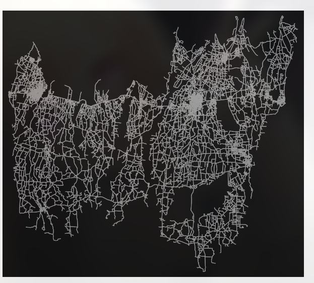

# 🛣️ Rural Road Planner

> **Bridging the gap: Optimizing rural infrastructure through intelligent road network prediction.**


## 💡 Inspiration
Rural connectivity is a major challenge in developing regions like **Jhapa**. Poor road planning leads to inefficient transportation and wasted resources. We built **Rural Road Planner** to solve this by identifying the most impactful missing links in a road network.

By inputting a District and Place name, planners can visualize exactly where new roads should be constructed to maximize connectivity.

## 🚀 Key Features

* **Interactive Geospatial Mapping:** Built with **Leaflet.js**, allowing users to explore road networks dynamically.
* **Granular Search:** Users can filter by **District** and **Place Name** (e.g., Gauradaha) to isolate specific communities.
* **Intelligent Prediction:** The system analyzes the existing road network and generates **Proposed Roads** (highlighted in Red/Blue) using Graph Neural Networks.
* **Map Modes:** Supports Standard Streets, Satellite, Dark, and Light modes.

### Visualizing the Data
*Below is a visualization of the road network for the Jhapa district used in our analysis:*



## 🛠️ Tech Stack

**Frontend:**
* **React.js**
* **Leaflet.js** (Map rendering)
* **Tailwind CSS** (Styling)

**Backend:**
* **FastAPI** (High-performance API)
* **Python**

**AI & Data:**
* **PyTorch Geometric** (GNN for Link Prediction)
* **OpenStreetMap (OSM)** (Raw geospatial data)

## ⚙️ How It Works

1.  **Data Ingestion:** The system loads road network data for the specific region.
2.  **User Input:** The user selects a target District and Municipality/Place.
3.  **Processing:** The **FastAPI** backend calculates the most efficient new road segments required to connect disconnected nodes.
4.  **Visualization:** The proposed roads are rendered on the frontend as color-coded segments overlaying the real-world map.

## 📦 Installation & Setup

### 1. Clone the repository
```bash
git clone [https://github.com/SaimonNeupane/rural-road-planner.git](https://github.com/SaimonNeupane/rural-road-planner.git)
cd rural-road-planner
